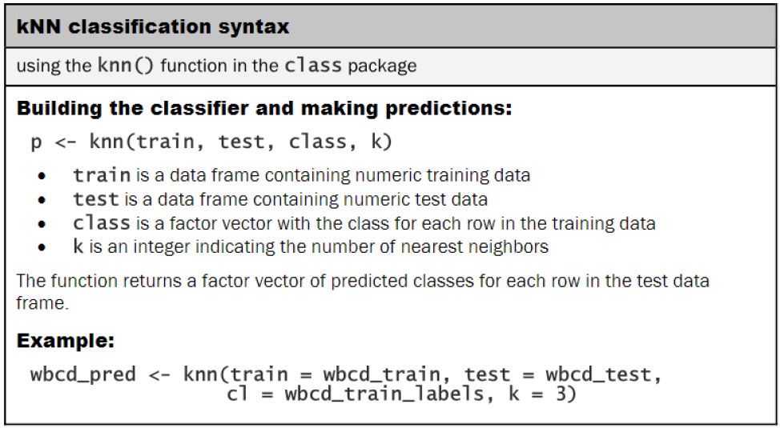

About the Dataset:

1. เป็นข้อมูลเกี่ยวกับแคมเปญของสถาบันธนาคารในประเทศโปรตุเกส `Telephonic marketing campaigns `
2. แคมเปญขึ้นอยู่กับการโทรของลูกค้า ซึ่งมีการติดต่อลูกค้ามากกว่า 1 ราย เพื่อเข้าถึงว่า ลูกค้าจะสมัครผลิตภัณฑ์ของแคมเปญ (เงินฝากธนาคาร) เป็น `yes or no` ซึ่งแสดงในคอลัมภ์ `y`
3. เป้าหมาย classification นี้ เพื่อคาดการณืว่าลูกค้าจะสมัครรับเงินฝากประจำหรือไม่ `ตัวแปร y`

# 1. Import Libraries 
```{r}
library(tidyverse)
library(DT)
library(scales) # use comma
library(class) # Model
library(caret) # confusion matrix
library(InformationValue) # confusion matrix
library(ModelMetrics)
```

# 2. Import Dataset
```{r}
Marketing_trian <- read.table(file = "train.csv", 
                              header = TRUE, 
                              sep = ";", 
                              stringsAsFactors = TRUE)

Marketing_test <- read.table(file = "test.csv", 
                             header = TRUE, 
                             sep = ";",
                             stringsAsFactors = TRUE)
```

# 3. Review Dataset
1. `age` → Age of the client
2. `job` → Type of job
3. `marital` → Marital Status of the client
4. `education` → Education Level
5. `default` → Credit in default
6. `balance` → average yearly balance, in euros
7. `housing` → If the person has taken a Housing Loan
8. `loan` → If the person has taken a Personal Loan
9. `contact` → contact communication type
10. `day` → Day of Week of Contact
11. `month` → Contact Month
12. `duration` → Contact Duration
13. `campaign` → number of contacts performed during this campaign to the client
14. `pdays` → number of days that passed by after the client was last contacted
15. `previous` → number of contacts performed before this campaign
16. `poutcome` → outcome of the previous marketing campaign
17. `y` → has the client subscribed a term deposit?

```{r}
# checking NA
sum(is.na(Marketing_trian))
sum(is.na(Marketing_test))
```

```{r}
str(Marketing_trian)
```

```{r}
datatable(Marketing_trian)
```

```{r}
str(Marketing_test)
```

```{r}
datatable(Marketing_test)
```

```{r}
data_class_factor <- c(2:5, 7:9, 11, 16, 17)

for (i in data_class_factor) {
  print(names(Marketing_trian)[i])
  
  print("Train Data (%):")
  print(round(prop.table(table(Marketing_trian[ , i])) * 100, digits = 1))
  
  print("Test Data (%):")
  print(round(prop.table(table(Marketing_test[ , i])) * 100, digits = 1))
}

```

```{r}
data_class_integer <- c(1, 6, 10, 12:15)

for (i in data_class_integer) {
  print(names(Marketing_trian)[i])
  
  print("Train Data(%):")
  print(summary(Marketing_trian[ , i]))
  
  print("Test Data(%):")
  print(summary(Marketing_test[ , i]))
}
```

# 4. Visualizations and Analysis
### 4.1 Plot Number of The client has subscribed a term deposit
```{r}
# create data frame of y 
y_dataset <- as.data.frame(table(Marketing_trian$y))
y_dataset$Percent <- paste(round(((y_dataset$Freq)/sum(y_dataset$Freq)) * 100, 
                                 digits = 2), 
                           "%")

ggplot(y_dataset, aes(x = Var1, y = Freq)) +
  geom_bar(stat = "identity", 
           fill = "#A3CCAB", 
           color = "black") +
  theme_bw() +
  scale_y_continuous(labels = comma, limits = c(0, 42000)) +
  geom_text(aes(label = Percent, vjust = -1)) +
  ggtitle("Number of The client has subscribed a term deposit") +
  theme(plot.title = element_text(hjust = 0.5),
        text = element_text(size = 12)) +
  xlab("") +
  ylab("") 
```

```{r}
round(prop.table(table(Marketing_trian$y)) * 100, digits = 2)
```

### 4.2 Plot Number of Age of the client
```{r}
ggplot(Marketing_trian, aes(x = age)) +
  geom_histogram(binwidth = 1, 
                 fill = "#638E95", 
                 color = "black") +
  theme_bw() +
  scale_y_continuous(labels = comma) +
  ggtitle("Number of Age of the client") +
  theme(plot.title = element_text(hjust = 0.5),
        text = element_text(size = 10)) +
  xlab("Age") +
  ylab("")
```

```{r}
summary(Marketing_trian$age)
```

### 4.3 Plot Number of Type of job of the client
```{r}
job_dataset <- as.data.frame(table(Marketing_trian$job))
job_dataset$Percent <- paste(round(((job_dataset$Freq)/sum(job_dataset$Freq)) * 100, 
                                   digits = 2), 
                             "%")

ggplot(job_dataset, aes(reorder(x = Var1, Freq), y = Freq)) +
  geom_bar(stat = "identity", 
           fill = "#BFB3A8") +
  coord_flip() +
  theme_bw() +
  scale_y_continuous(labels = comma, limits = c(0, 10500)) +
  geom_text(aes(label = Percent, vjust = 0.5, hjust = -0.1), size = 3) +
  theme(plot.title = element_text(hjust = 0.5),
        text = element_text(size = 12)) +
  labs(title = "Number of Type of job of the client",
       x = "",
       y = "") 
```

```{r}
round(prop.table(table(Marketing_trian$job)) * 100, digits = 2)
```

### 4.4 Plot Number of Marital Status of the client
```{r}
marital_dataset <- as.data.frame(table(Marketing_trian$marital))
marital_dataset$Percent <- paste(round(((marital_dataset$Freq)/sum(marital_dataset$Freq)) * 100, digits = 2), "%")

ggplot(marital_dataset, aes(x = Var1, y = Freq)) +
  geom_bar(stat = "identity",
           fill = "#22BABB", 
           color = "black") +
  theme_bw() +
  scale_y_continuous(labels = comma, limits = c(0, 30000)) +
  geom_text(aes(label = Percent, vjust = -1), size = 3.2) +
  ggtitle("Number of Marital Status of the client") +
  theme(plot.title = element_text(hjust = 0.5),
        text = element_text(size = 12)) +
  xlab("") +
  ylab("")
```

```{r}
round(prop.table(table(Marketing_trian$marital)) * 100, digits = 2)
```

### 4.5 Plot Number of Education Level of the client
```{r}
education_dataset <- as.data.frame(table(Marketing_trian$education))
education_dataset$Percent <- paste(round(((education_dataset$Freq)/sum(education_dataset$Freq)) * 100, digits = 2), "%")

ggplot(education_dataset, aes(x = Var1, y = Freq)) +
  geom_bar(stat = "identity",
           fill = "#103778", 
           color = "black") +
  theme_bw() +
  scale_y_continuous(labels = comma, limits = c(0, 25000)) +
  geom_text(aes(label = Percent, vjust = -1), size = 3.2) +
  ggtitle("Number of Education Level of the client") +
  theme(plot.title = element_text(hjust = 0.5),
        text = element_text(size = 12)) +
  xlab("") +
  ylab("")
```

```{r}
round(prop.table(table(Marketing_trian$education)) * 100, digits = 2)
```

### 4.6 Plot Number of Credit in default of the client
```{r}
default_dataset <- as.data.frame(table(Marketing_trian$default))
default_dataset$Percent <- paste(round(((default_dataset$Freq)/sum(default_dataset$Freq)) * 100, digits = 2), "%")

ggplot(default_dataset, aes(x = Var1, y = Freq)) +
  geom_bar(stat = "identity",
           fill = "#EA7E7E", 
           color = "black") +
  theme_bw() +
  scale_y_continuous(labels = comma, limits = c(0, 50000)) +
  geom_text(aes(label = Percent, vjust = -1), size = 3.2) +
  ggtitle("Number of Credit in default of the client") +
  theme(plot.title = element_text(hjust = 0.5),
        text = element_text(size = 12)) +
  xlab("") +
  ylab("")
```

```{r}
round(prop.table(table(Marketing_trian$default)) * 100, digits = 2)
```

### 4.7 Plot Number of Average yearly balance, in euros of the client
```{r}
ggplot(Marketing_trian, aes(x = balance)) +
  geom_area(stat = "bin",
            fill = "#CBD5C0", 
            color = "black") +
  theme_bw() +
  scale_y_continuous(labels = comma) +
  scale_x_continuous(labels = comma) +
  ggtitle("Number of Average yearly balance, in euros of the client") +
  theme(plot.title = element_text(hjust = 0.5),
        text = element_text(size = 12)) +
  xlab("Average yearly balance, in euros") +
  ylab("")
```

```{r}
summary(Marketing_trian$balance)
```

### 4.8 Plot Number of The person has taken a Housing Loan
```{r}
housing_dataset <- as.data.frame(table(Marketing_trian$housing))
housing_dataset$Percent <- paste(round(((housing_dataset$Freq)/sum(housing_dataset$Freq)) * 100, digits = 2), "%")

ggplot(housing_dataset, aes(x = Var1, y = Freq)) +
  geom_bar(stat = "identity",
           fill = "#646C8F", 
           color = "black") +
  theme_bw() +
  scale_y_continuous(labels = comma, limits = c(0, 28000)) +
  geom_text(aes(label = Percent, vjust = -1), size = 3.2) +
  ggtitle("Number of The person has taken a Housing Loan") +
  theme(plot.title = element_text(hjust = 0.5),
        text = element_text(size = 12)) +
  xlab("") +
  ylab("")
```

```{r}
round(prop.table(table(Marketing_trian$housing)) * 100, digits = 2)
```

### 4.9 Plot Number of The person has taken a Personal Loan
```{r}
loan_dataset <- as.data.frame(table(Marketing_trian$loan))
loan_dataset$Percent <- paste(round(((loan_dataset$Freq)/sum(loan_dataset$Freq)) * 100, digits = 2), "%")

ggplot(loan_dataset, aes(x = Var1, y = Freq)) +
  geom_bar(stat = "identity",
           fill = "#FFC2B5", 
           color = "black") +
  theme_bw() +
  scale_y_continuous(labels = comma, limits = c(0, 40000)) +
  geom_text(aes(label = Percent, vjust = -1), size = 3.2) +
  ggtitle("Number of The person has taken a Personal Loan") +
  theme(plot.title = element_text(hjust = 0.5),
        text = element_text(size = 12)) +
  xlab("") +
  ylab("")
```

```{r}
round(prop.table(table(Marketing_trian$loan)) * 100, digits = 2)
```

### 4.10 Plot Number of contact communication type of the client
```{r}
contact_dataset <- as.data.frame(table(Marketing_trian$contact))
contact_dataset$Percent <- paste(round(((contact_dataset$Freq)/sum(contact_dataset$Freq)) * 100, digits = 2), "%")

ggplot(contact_dataset, aes(x = Var1, y = Freq)) +
  geom_bar(stat = "identity",
           fill = "#97A6A0", 
           color = "black") +
  theme_bw() +
  scale_y_continuous(labels = comma, limits = c(0, 32000)) +
  geom_text(aes(label = Percent, vjust = -1), size = 3.2) +
  ggtitle("Number of contact communication type of the client") +
  theme(plot.title = element_text(hjust = 0.5),
        text = element_text(size = 12)) +
  xlab("") +
  ylab("")
```

```{r}
round(prop.table(table(Marketing_trian$contact)) * 100, digits = 2)
```

### 4.11 Plot Number of Last contact day of the month
```{r}
ggplot(Marketing_trian, aes(x = day)) +
  geom_area(stat = "bin",
            fill = "#DCC3A1", 
            color = "black") +
  theme_bw() +
  scale_y_continuous(labels = comma) +
  ggtitle("Number of Last contact day of the month") +
  theme(plot.title = element_text(hjust = 0.5),
        text = element_text(size = 12)) +
  xlab("Day of Month") +
  ylab("")
```

```{r}
summary(Marketing_trian$day)
```

### 4.12 Plot Number of Last contact month of year
```{r}
# sort by chronological month order
Marketing_trian$month <- factor(Marketing_trian$month,
                                levels = c("jan", 
                                           "feb", 
                                           "mar", 
                                           "apr",
                                           "may", 
                                           "jun", 
                                           "jul", 
                                           "aug",
                                           "sep", 
                                           "oct", 
                                           "nov", 
                                           "dec")) 

month_dataset <- as.data.frame(table(Marketing_trian$month))
month_dataset$Percent <- paste(round(((month_dataset$Freq)/sum(month_dataset$Freq)) * 100, digits = 2), "%")

ggplot(month_dataset, aes(x = Var1, y = Freq)) +
  geom_bar(stat = "identity", 
           fill = "#F2C12E") +
  coord_flip() +
  theme_bw() +
  scale_y_continuous(labels = comma, limits = c(0, 15000)) +
  scale_x_discrete(limits = rev(levels(Marketing_trian$month))) +
  geom_text(aes(label = Percent, vjust = 0.5, hjust = -0.1), size = 3) +
  theme(plot.title = element_text(hjust = 0.5),
        text = element_text(size = 12)) +
  labs(title = "Number of Last contact month of year",
       x = "",
       y = "") 
```

```{r}
round(prop.table(table(Marketing_trian$month)) * 100, digits = 2)
```

### 4.13 Plot Number of Last contact duration, in seconds
```{r}
ggplot(Marketing_trian, aes(x = duration)) +
  geom_area(stat = "bin",
            fill = "#BDE038", 
            color = "black") +
  theme_bw() +
  scale_y_continuous(labels = comma) +
  scale_x_continuous(labels = comma) +
  ggtitle("Number of Contact Duration of the client") +
  theme(plot.title = element_text(hjust = 0.5),
        text = element_text(size = 12)) +
  xlab("Contact Duration, in seconds") +
  ylab("")
```

```{r}
summary(Marketing_trian$duration)
```

### 4.14 Plot Number of contacts performed during this campaign to the client
```{r}
ggplot(Marketing_trian, aes(x = campaign)) +
  geom_histogram(binwidth = 1, 
                 fill = "#638E95", 
                 color = "black") +
  theme_bw() +
  scale_y_continuous(labels = comma) +
  ggtitle("Number of contacts performed during this campaign to the client") +
  theme(plot.title = element_text(hjust = 0.5),
        text = element_text(size = 10)) +
  xlab("Number of Contacts") +
  ylab("")
```

```{r}
ggplot(Marketing_trian, aes(x = campaign)) +
  geom_area(stat = "bin",
            fill = "#638E95", 
            color = "black") +
  theme_bw() +
  scale_y_continuous(labels = comma) +
  ggtitle("Number of contacts performed during this campaign to the client") +
  theme(plot.title = element_text(hjust = 0.5),
        text = element_text(size = 10)) +
  xlab("Number of Contacts") +
  ylab("")
```

```{r}
summary(Marketing_trian$campaign)
```

### 4.15 Plot Number of days that passed by after the client was last contacted from a previous campaign
-1 means client was not previously contacted

```{r}
ggplot(Marketing_trian, aes(x = pdays)) +
  geom_area(stat = "bin",
            fill = "#D2E8E3", 
            color = "black") +
  theme_bw() +
  scale_y_continuous(labels = comma) +
  scale_x_continuous(labels = comma) +
  ggtitle("Number of days that passed by after the client was last contacted") +
  theme(plot.title = element_text(hjust = 0.5),
        text = element_text(size = 12)) +
  xlab("Number of Days") +
  ylab("")
```

```{r}
summary(Marketing_trian$pdays)
```

```{r}
# % of cases which are -1 (meaning not previously contacted)
paste("client was not previously contacted (-1):", 
      round(sum(Marketing_trian$pdays == -1)/nrow(Marketing_trian) * 100, digits = 2), 
      "%")
```

### 4.16 Plot Number of contacts performed before this campaign to the client
0 means client was not previously contacted

```{r}
ggplot(Marketing_trian, aes(x = previous)) +
  geom_area(stat = "bin",
            fill = "#FF81D0", 
            color = "black") +
  theme_bw() +
  scale_y_continuous(labels = comma) +
  scale_x_continuous(labels = comma) +
  ggtitle("Number of contacts performed before this campaign") +
  theme(plot.title = element_text(hjust = 0.5),
        text = element_text(size = 12)) +
  xlab("Number of Contacts") +
  ylab("")
```

```{r}
summary(Marketing_trian$previous)
```

```{r}
# % of cases which are 0 (meaning not previously contacted)
paste("client was not previously contacted (0):", 
      round(sum(Marketing_trian$previous == 0)/nrow(Marketing_trian) * 100, 
            digits = 2), 
      "%")
```

### 4.17 Plot Number of Outcome of the previous marketing campaign
```{r}
poutcome_dataset <- as.data.frame(table(Marketing_trian$poutcome))
poutcome_dataset$Percent <- paste(round(((poutcome_dataset$Freq)/sum(poutcome_dataset$Freq)) * 100, digits = 2), "%")

ggplot(poutcome_dataset, aes(x = Var1, y = Freq)) +
  geom_bar(stat = "identity",
           fill = "#BDA523", 
           color = "black") +
  theme_bw() +
  scale_y_continuous(labels = comma, limits = c(0, 40000)) +
  geom_text(aes(label = Percent, vjust = -1), size = 3.2) +
  ggtitle("Number of Outcome of the previous marketing campaign") +
  theme(plot.title = element_text(hjust = 0.5),
        text = element_text(size = 12)) +
  xlab("") +
  ylab("")
```

```{r}
round(prop.table(table(Marketing_trian$poutcome)) * 100, digits = 2)
```

# Statistical Models For Classification

# 5. K Nearest Neighbors

the steps for making this knn model:

5.1 creating a copy of the dataset.
5.2 converting all X variables that are factors to numeric
5.3 scaling all the X variables.
5.4 using linear regression for each x to y for feature selection
5.5 using accuracy to decide the best k for the model.
5.6 making a confution matrix and calculating classification metrics for each step (for comparison).

### 5.1 Creating a copy of the dataset
```{r}
KNN_dataset <- Marketing_trian
head(KNN_dataset)
str(KNN_dataset)
```

```{r}
# no = 1
# yes = 2
unique(KNN_dataset$y)
table(KNN_dataset$y)
```

### 5.2 Converting all variables to numeric (except variable y)
```{r}
for (i in 1:16) {
  KNN_dataset[ , i] <- as.numeric(KNN_dataset[ , i])
}

KNN_dataset$pdays[KNN_dataset$pdays == -1] <- 0
KNN_dataset$previous[KNN_dataset$previous == -1] <- 0

head(KNN_dataset)

str(KNN_dataset)
```

### 5.3 Scaling all variables (except variable y)
`sapply` will change the result to `vector`

```{r}
KNN_dataset_2 <- sapply(KNN_dataset[ , 1:16], scale)

KNN_dataset_2 <- as.data.frame(KNN_dataset_2)

KNN_dataset <- cbind(KNN_dataset_2, KNN_dataset$y)
```

```{r}
head(KNN_dataset)
```

### 5.4 Using Linear Regression for feature selection
#### 5.4.1 Linear Regression Model
```{r}
KNN_dataset_2 <- KNN_dataset
KNN_dataset_2[ , 17] <- as.numeric(KNN_dataset_2[ , 17])

for (i in 1:16) {
  print(names(KNN_dataset_2)[i])
  print(summary(lm(KNN_dataset_2[ , 17] ~ KNN_dataset_2[ , i], 
                   data = KNN_dataset_2)))
}

```

### 5.5 K-Nearest Neighbour Model
#### 5.5.1 split dataset
```{r}
set.seed(8)
n_KNN <- nrow(KNN_dataset_2)
id_KNN <- sample(1:n_KNN, size = 0.75*n_KNN)
train_KNN <- KNN_dataset[id_KNN, ]
test_KNN <- KNN_dataset[-id_KNN, ]
```

#### 5.5.2 k-Nearest Neighbour Model with k = 3
```{r}

```

```{r}
x_train_KNN <- train_KNN[ , -17] 
x_test_KNN <- test_KNN[ , -17] 
y_train_KNN <- train_KNN[ , 17] 
y_test_KNN <- test_KNN[ , 17] 

KNN_3 <- knn(train = x_train_KNN, 
             test = x_test_KNN, 
             cl = y_train_KNN, 
             k = 3)
```

#### 5.5.3 Confusion Matrix and Statistics with k = 3
```{r}
# 1 = no
# 2 = yes
table_k_3 <- table(predicted = KNN_3, true = y_test_KNN)
table_k_3
```

```{r}
Accuracy_k_3 <- paste("Accuracy:", 
                      round((table_k_3[1] + table_k_3[4])/sum(table_k_3) * 100, digits = 2), 
                      "%")
Accuracy_k_3
```

```{r}
lvs <- c("no", "yes")

truth_k_3 <- factor(rep(lvs, times = c(9940, 1363)),
                    levels = rev(lvs))

pred_k_3 <- factor(c(rep(lvs, times = c(9539, 401)),
                     rep(lvs, times = c(853, 510))),
                   levels = rev(lvs))

caret::confusionMatrix(pred_k_3, truth_k_3, dnn = c("Predict", "Actual"))
```

#### 5.5.4 Visualization
```{r}
table_k_3new <- data.frame(caret::confusionMatrix(pred_k_3, truth_k_3)$table)
datatable(table_k_3new)

plot_table_k_3 <- table_k_3new %>% 
                    mutate(goodbad = ifelse(table_k_3new$Prediction == table_k_3new$Reference, "good", "bad")) %>% 
                    group_by(Reference) %>% 
                    mutate(prop = Freq/sum(Freq))
datatable(plot_table_k_3)
```

```{r}
ggplot(data = plot_table_k_3, aes(x = Reference, 
                                  y = Prediction, 
                                  fill = goodbad,
                                  alpha = prop)) +
  geom_tile() +
  geom_text(aes(label = Freq), 
            vjust = 0.5, 
            fontface = "bold", 
            alpha = 1,
            size = 10) +
  scale_fill_manual(values = c(good = "#A3CCAB", bad = "#F23030")) +
  ggtitle("Prediction vs Actual") +
  theme_bw() +
  theme(plot.title = element_text(hjust = 0.5),
        panel.grid.major = element_blank(), 
        panel.grid.minor = element_blank()) +
  xlim(rev(levels(table_k_3new$Reference))) +
  theme(text = element_text(size = 20)) +
  xlab("Actual")
```

#### 5.5.5 Using accuracy to decide the best k for the model
```{r}
k <- seq(from = 1, to = 29, by = 2)
i <- 1
Accuracy <- 1

for (i in k) {
  KNN_mod <- knn(train = x_train_KNN,
                 test = x_test_KNN,
                 cl = y_train_KNN, # class
                 k = i) 
  Accuracy[i] <- 100 * sum(y_test_KNN == KNN_mod)/length(y_test_KNN)
  k = i
  cat("k =", k, "Accuracy:", Accuracy[i], "\n")
}

```

#### 5.5.6 plot accuracy to decide the best k for the model
```{r}
Accuracy <- Accuracy[!is.na(Accuracy)]
k <- seq(from = 1, to = 29, by = 2)
Accuracy_plot <- data.frame(k , Accuracy)
datatable(Accuracy_plot)

ggplot(data = Accuracy_plot, aes(x = k, y = Accuracy)) +
  geom_line(color = "red") +
  geom_point(color = "red") +
  geom_text(aes(label = round(Accuracy, digits = 2)), vjust = -0.4) +
  theme_dark()
```

#### 5.5.7 k-Nearest Neighbour model with k = 15 (best k = 15)
```{r}
# 1 = no
# 2 = yes
KNN_k_15 <- knn(train = x_train_KNN,
                test = x_test_KNN,
                cl = y_train_KNN,
                k = 15)
```

#### 5.5.8 Confusion Matrix and Statistics with k = 15
```{r}
table_k_15 <- table(predicted = KNN_k_15, true = y_test_KNN)
table_k_15
```

```{r}
lvs <- c("no", "yes")

truth_k_15 <- factor(rep(lvs, times = c(9940, 1363)),
                       levels = rev(lvs))

pred_k_15 <- factor(c(rep(lvs, times = c(9744, 196)),
                        rep(lvs, times = c(980, 383))),
                      levels = rev(lvs))

caret::confusionMatrix(pred_k_15, truth_k_15, dnn = c("Predict", "Actual"))
```

#### 5.5.9 Visualization
```{r}
table_k_15new <- data.frame(caret::confusionMatrix(pred_k_15, truth_k_15)$table)
datatable(table_k_15new)

plot_table_k_15 <- table_k_15new %>% 
                     mutate(goodbad = ifelse(table_k_15new$Prediction == table_k_15new$Reference, "good", "bad")) %>% 
                     group_by(Reference) %>% 
                     mutate(prop = Freq/sum(Freq))

datatable(plot_table_k_15)
```

```{r}
ggplot(data = plot_table_k_15, aes(x = Reference, 
                                   y = Prediction, 
                                   fill = goodbad,
                                   alpha = prop)) +
  geom_tile() +
  geom_text(aes(label = Freq), 
            vjust = 0.5, 
            fontface = "bold", 
            alpha = 1,
            size = 10) +
  scale_fill_manual(values = c(good = "#008C7E", bad = "#D94602")) +
  ggtitle("Prediction vs Actual") +
  theme_bw() +
  theme(plot.title = element_text(hjust = 0.5),
        panel.grid.major = element_blank(), 
        panel.grid.minor = element_blank()) +
  xlim(rev(levels(table_k_15new$Reference))) +
  theme(text = element_text(size = 20)) +
  xlab("Actual")
```


# 6. Logistic Regression

the steps for making this logistic regression model:

6.1 creating a copy of the dataset.
6.2 creating dummy variables and checking for statistical significance.
6.3 creating the model.
6.4 checking the model at optimal cutoff.
6.5 making a confution matrix and calculating classification metrics for each step (for comparison).

### 6.1 creating a copy of the dataset
```{r}
Logistic_dataset <- Marketing_trian
head(Logistic_dataset)
str(Logistic_dataset)
```

### 6.2 creating dummy variables and checking for statistical significance
```{r}
# install.packages("fastDummies")
library(fastDummies)

Logistic_dataset <- dummy_cols(.data = Logistic_dataset,
                               select_columns = c("job",
                                                  "marital",
                                                  "education",
                                                  "contact",
                                                  "month",
                                                  "poutcome"))

head(Logistic_dataset)
```

### 6.3 creating the model
```{r}
str(Logistic_dataset)
```

#### 6.3.1 Linear Regression
```{r}
Logistic_dataset_2 <- Logistic_dataset
Logistic_dataset_2[ , 17] <- as.numeric(Logistic_dataset_2[ , 17])

for (i in 18:55) {
  print(names(Logistic_dataset_2)[i])
  print(summary(glm(Logistic_dataset_2[ , 17] ~ Logistic_dataset_2[ , i], data = Logistic_dataset_2)))
}
```

#### 6.3.2 Logistic Regression Model
```{r}
str(Logistic_dataset)
```

```{r}
Logistic_dataset <- Logistic_dataset[ , -c(2, 3, 4, 9, 11, 16, 18, 24, 27, 29, 30, 40, 47)]
head(Logistic_dataset)
str(Logistic_dataset)
```

```{r}
# no = 1
# yes = 2 
Logistic_dataset$default <- as.numeric(Logistic_dataset$default)
Logistic_dataset$housing <- as.numeric(Logistic_dataset$housing)
Logistic_dataset$loan <- as.numeric(Logistic_dataset$loan)
Logistic_dataset$y <- as.numeric(Logistic_dataset$y)

# 0 = FALSE
# 1 = TRUE
Logistic_dataset$default <- ifelse(Logistic_dataset$default == 2, 1, 0)
Logistic_dataset$housing = ifelse(Logistic_dataset$housing == 2, 1, 0)
Logistic_dataset$loan = ifelse(Logistic_dataset$loan == 2, 1, 0)
Logistic_dataset$y = ifelse(Logistic_dataset$y == 2, 1, 0)
```

```{r}
# install.packages("FSA")
library(FSA)

headtail(Logistic_dataset)
```
#### 6.3.3 split dataset
```{r}
# install.packages("mccr")
library(mccr)

set.seed(8)
n_Logistic <- nrow(Logistic_dataset)
id_Logistic <- sample(1:n_Logistic, size = 0.75*n_Logistic)
train_data_Logistic <- Logistic_dataset[id_Logistic, ]
test_data_Logistic <- Logistic_dataset[-id_Logistic, ]
```

```{r}
Logistic_model <- glm(y ~ ., data = train_data_Logistic, family = "binomial")
summary(Logistic_model)
```

#### 6.3.4 Accuracy Train
```{r}
probabilities_Logistic_train <- predict(Logistic_model,
                                        type = "response")

predicted_Logistic_train <- ifelse(probabilities_Logistic_train > 0.5, 1, 0)

paste("Accuracy Train:", 
      round(mean(predicted_Logistic_train == train_data_Logistic$y) * 100, digits = 2), 
      "%")
```

```{r}
table(predicted_Logistic_train, 
      train_data_Logistic$y, 
      dnn = c("prediction", "actual"))
```

#### 6.3.5 Accuracy Test
```{r}
probabilities_Logistic_test <- predict(Logistic_model, 
                                       newdata = test_data_Logistic,
                                       type = "response")

predicted_Logistic_test <- ifelse(probabilities_Logistic_test > 0.5, 1, 0)

paste("Accuracy Test:", 
      round(mean(predicted_Logistic_test == test_data_Logistic$y) * 100, digits = 2), 
      "%")
```

```{r}
table(predicted_Logistic_test, 
      test_data_Logistic$y, 
      dnn = c("prediction", "actual"))
```

#### 6.3.6 ROC Curve
```{r}
prediction_Logistic_test <- predict(Logistic_model, 
                                    newdata = test_data_Logistic,
                                    type = "response")

# install.packages("InformationValue")
library(InformationValue)

plotROC(test_data_Logistic$y, prediction_Logistic_test)
```

#### 6.3.7 Confusion Matrix and Statistics
```{r}
library(InformationValue )

InformationValue::confusionMatrix(actuals = test_data_Logistic$y,
                                  predictedScores = prediction_Logistic_test, 
                                  threshold = 0.5)
```

```{r}
library(caret)

lvs <- c("no", "yes")
truth_Logistic <- factor(rep(lvs, times = c(9940, 1363)),
                         levels = rev(lvs))
pred_Logistic <- factor(c(rep(lvs, times = c(9712, 228)),
                          rep(lvs, times = c(901, 462))),
                        levels = rev(lvs))

caret::confusionMatrix(pred_Logistic, truth_Logistic)
```

#### 6.3.8 Visualization
```{r}
table_Logistic <- data.frame(caret::confusionMatrix(pred_Logistic, truth_Logistic)$table)
datatable(table_Logistic)

plot_table_Logistic <- table_Logistic %>% 
                         mutate(goodbad = ifelse(table_Logistic$Prediction == table_Logistic$Reference, "good", "bad")) %>% 
                         group_by(Reference) %>% 
                         mutate(prop = Freq/sum(Freq))

datatable(plot_table_Logistic)
```

```{r}
ggplot(data = plot_table_Logistic, aes(x = Reference, 
                                       y = Prediction, 
                                       fill = goodbad,
                                       alpha = prop)) +
  geom_tile() +
  geom_text(aes(label = Freq), 
            vjust = 0.5, 
            fontface = "bold", 
            alpha = 1,
            size = 10) +
  scale_fill_manual(values = c(good = "#1B7F79", bad = "#FF4858")) +
  ggtitle("Prediction vs Actual") +
  theme_bw() +
  theme(plot.title = element_text(hjust = 0.5),
        panel.grid.major = element_blank(), 
        panel.grid.minor = element_blank()) +
  xlim(rev(levels(table_Logistic$Reference))) +
  theme(text = element_text(size = 20)) +
  xlab("Actual")
```

### 6.4 Optimal Cut-Off Point
```{r}
optCutOff <- optimalCutoff(actuals = test_data_Logistic$y, 
                           predictedScores = prediction_Logistic_test, 
                           optimiseFor = "misclasserror")
optCutOff
```

#### 6.4.1 Confusion Matrix and Statistics
```{r}
InformationValue::confusionMatrix(actuals = test_data_Logistic$y,
                                  predictedScores = prediction_Logistic_test,
                                  threshold = optCutOff)
```

```{r}
lvs <- c("no", "yes")
truth_Logistic <- factor(rep(lvs, times = c(9940, 1363)),
                         levels = rev(lvs))
pred_Logistic_CutOff <- factor(c(rep(lvs, times = c(9562, 378)),
                                 rep(lvs, times = c(740, 623))),
                               levels = rev(lvs))

caret::confusionMatrix(pred_Logistic_CutOff, truth_Logistic)
```

#### 6.4.2 Visualization
```{r}
table_Logistic_CutOff <- data.frame(caret::confusionMatrix(pred_Logistic_CutOff, truth_Logistic)$table)
datatable(table_Logistic_CutOff)

plot_table_Logistic_CutOff <- table_Logistic_CutOff %>% 
                                mutate(goodbad = ifelse(table_Logistic_CutOff$Prediction == table_Logistic_CutOff$Reference, "good", "bad")) %>% 
                                group_by(Reference) %>% 
                                mutate(prop = Freq/sum(Freq))

datatable(plot_table_Logistic_CutOff)
```

```{r}
ggplot(data = plot_table_Logistic_CutOff, aes(x = Reference, 
                                              y = Prediction, 
                                              fill = goodbad,
                                              alpha = prop)) +
  geom_tile() +
  geom_text(aes(label = Freq), 
            vjust = 0.5, 
            fontface = "bold", 
            alpha = 1,
            size = 10) +
  scale_fill_manual(values = c(good = "#1B7F79", bad = "#FF4858")) +
  ggtitle("Prediction vs Actual") +
  theme_bw() +
  theme(plot.title = element_text(hjust = 0.5),
        panel.grid.major = element_blank(), 
        panel.grid.minor = element_blank()) +
  xlim(rev(levels(table_Logistic_CutOff$Reference))) +
  theme(text = element_text(size = 20)) +
  xlab("Actual")
```

# 7. Decision Tree
```{r}
Tree_dataset <- Marketing_trian

head(Tree_dataset)
```

### 7.1 split dataset
```{r}
set.seed(8)
n_Tree <- nrow(Tree_dataset)
id_Tree <- sample(1:n_Tree, size = 0.75*n_Tree)
Train_Tree <- Tree_dataset[id_Tree, ]
Test_Tree <- Tree_dataset[-id_Tree, ]
y_Test_Tree <- Tree_dataset[-id_Tree, 17]
```

### 7.2 Decision Tree Model
```{r}
# install.packages("tree")
library(tree)

Tree_model <- tree(y ~ ., data = Tree_dataset, subset = id_Tree)
summary(Tree_model)
```

### 7.3 plot Decision Tree Model 
```{r}
# install.packages("ISLR")
library(ISLR)

plot(Tree_model)
text(Tree_model, pretty = 0, cex = 0.7)
```

#### 7.3.1 Accuracy Train
```{r}
probabilities_Tree_train <- predict(Tree_model,
                                    type = "class")

paste("Accuracy Train:", 
      round(mean(probabilities_Tree_train == Train_Tree$y) * 100, digits = 2), 
      "%")
```

#### 7.3.2 Accuracy Test
```{r}
probabilities_Tree_test <- predict(Tree_model, 
                                   newdata = Test_Tree,
                                   type = "class")

paste("Accuracy Test:", 
      round(mean(probabilities_Tree_test == Test_Tree$y) * 100, digits = 2), 
      "%")
```

#### 7.3.3 Confusion Matrix and Statistics
```{r}
table(probabilities_Tree_test, 
      Test_Tree$y, 
      dnn = c("prediction", "actual"))
```

```{r}
lvs <- c("no", "yes")
truth_Tree <- factor(rep(lvs, times = c(9940, 1363)),
                     levels = rev(lvs))
pred_Tree <- factor(c(rep(lvs, times = c(9409, 531)),
                      rep(lvs, times = c(725, 638))),
                    levels = rev(lvs))

caret::confusionMatrix(pred_Tree, truth_Tree)
```

#### 7.3.4 Visualization
```{r}
table_Tree <- data.frame(caret::confusionMatrix(pred_Tree, truth_Tree)$table)
datatable(table_Tree)

plot_table_Tree <- table_Tree %>% 
                     mutate(goodbad = ifelse(table_Tree$Prediction == table_Tree$Reference, "good", "bad")) %>% 
                     group_by(Reference) %>% 
                     mutate(prop = Freq/sum(Freq))

datatable(plot_table_Tree)
```

```{r}
ggplot(data = plot_table_Tree, aes(x = Reference, 
                                   y = Prediction, 
                                   fill = goodbad,
                                   alpha = prop)) +
  geom_tile() +
  geom_text(aes(label = Freq), 
            vjust = 0.5, 
            fontface = "bold", 
            alpha = 1,
            size = 10) +
  scale_fill_manual(values = c(good = "#1B7F79", bad = "#FF4858")) +
  ggtitle("Prediction vs Actual") +
  theme_bw() +
  theme(plot.title = element_text(hjust = 0.5),
        panel.grid.major = element_blank(), 
        panel.grid.minor = element_blank()) +
  xlim(rev(levels(table_Tree$Reference))) +
  theme(text = element_text(size = 20)) +
  xlab("Actual")
```


### 7.4 Cross-validation for Choosing Tree Complexity
#### 7.4.1 K-means Algorithm with Elbow Method (decide the best k)
```{r}
set.seed(8)
Elbow_model = cv.tree(object = Tree_model, 
                      FUN = prune.misclass)

plot(x = Elbow_model$size,
     y = Elbow_model$dev,
     type = "b",
     xlab = "Number of clusters K",
     ylab = "Total within-cluster sum of square")
```

### 7.5 Cost-complexity Pruning of Tree Object 
#### 7.5.1 Pruning of Tree Model with k = 9
```{r}
Prune_Tree_model <- prune.misclass(tree = Tree_model, best = 9)
summary(Prune_Tree_model)

plot(Prune_Tree_model)
text(Prune_Tree_model, pretty = 0, cex = 0.7)
```

#### 7.5.2 Pruning of Tree Model with k = 4 (the best k = 4)
```{r}
Prune_Tree_model_4 <- prune.misclass(tree = Tree_model, best = 4)
summary(Prune_Tree_model)

plot(Prune_Tree_model_4)
text(Prune_Tree_model_4, pretty = 0, cex = 1)
```

#### 7.5.3 Accuracy Train
```{r}
probabilities_Tree_train_Prune <- predict(Prune_Tree_model_4,
                                          type = "class")

paste("Accuracy Train:", 
      round(mean(probabilities_Tree_train_Prune == Train_Tree$y) * 100, digits = 2), 
      "%")
```

```{r}
table(probabilities_Tree_train_Prune, 
      Train_Tree$y, 
      dnn = c("prediction", "actual"))
```

#### 7.5.4 Accuracy Test
```{r}
probabilities_Tree_test_Prune <- predict(Prune_Tree_model_4, 
                                         newdata = Test_Tree,
                                         type = "class")

paste("Accuracy Test:", 
      round(mean(probabilities_Tree_test_Prune == Test_Tree$y) * 100, digits = 2), 
      "%")
```

#### 7.5.5 Confusion Matrix and Statistics
```{r}
table(probabilities_Tree_test_Prune, 
      Test_Tree$y, 
      dnn = c("prediction", "actual"))
```

```{r}
lvs <- c("no", "yes")
truth_Tree_Prune <- factor(rep(lvs, times = c(9940, 1363)),
                           levels = rev(lvs))
pred_Tree_Prune <- factor(c(rep(lvs, times = c(9409, 531)),
                            rep(lvs, times = c(725, 638))),
                          levels = rev(lvs))

caret::confusionMatrix(pred_Tree_Prune, truth_Tree_Prune)
```

#### 7.5.6 Visualization
```{r}
table_Tree_Prune <- data.frame(caret::confusionMatrix(pred_Tree_Prune, truth_Tree_Prune)$table)
datatable(table_Tree_Prune)

plot_table_Tree_Prune <- table_Tree_Prune %>% 
                           mutate(goodbad = ifelse(table_Tree_Prune$Prediction == table_Tree_Prune$Reference, "good", "bad")) %>% 
                           group_by(Reference) %>% 
                           mutate(prop = Freq/sum(Freq))

datatable(plot_table_Tree_Prune)
```

```{r}
ggplot(data = plot_table_Tree_Prune, aes(x = Reference, 
                                         y = Prediction, 
                                         fill = goodbad,
                                         alpha = prop)) +
  geom_tile() +
  geom_text(aes(label = Freq), 
            vjust = 0.5, 
            fontface = "bold", 
            alpha = 1,
            size = 10) +
  scale_fill_manual(values = c(good = "#1B7F79", bad = "#FF4858")) +
  ggtitle("Prediction vs Actual") +
  theme_bw() +
  theme(plot.title = element_text(hjust = 0.5),
        panel.grid.major = element_blank(), 
        panel.grid.minor = element_blank()) +
  xlim(rev(levels(table_Tree_Prune$Reference))) +
  theme(text = element_text(size = 20)) +
  xlab("Actual")
```

# 8. Random Forest
```{r}
Forest_dataset <- Marketing_trian

head(Forest_dataset)
```

```{r}
str(Forest_dataset)
```

### 8.1 split dataset
```{r}
set.seed(8)
n_Forest <- nrow(Marketing_trian)
id_Forest <- sample(1:n_Forest, size = 0.75*n_Forest)
train_Forest <- Forest_dataset[id_Forest, ]
test_Forest <- Forest_dataset[-id_Forest, ]
```

### 8.2 Random Forest Model
```{r}
library(randomForest)

set.seed(8)
Forest_model <- randomForest(y ~ ., data = train_Forest, importance = TRUE)
Forest_model
```

```{r}
importance(Forest_model)
```

```{r}
varImpPlot(Forest_model, cex = 1)
```

### 8.3 Accuracy Train
```{r}
probabilities_Forest_train <- predict(Forest_model)

paste("Accuracy Train:", 
      round(mean(probabilities_Forest_train == train_Forest$y) * 100, digits = 2), 
      "%")
```

```{r}
caret::confusionMatrix(data = probabilities_Forest_train, 
                       reference = train_Forest$y, 
                       positive = "yes", 
                       dnn = c("Prediction", "Actual"))
```

### 8.4 Accuracy Test
```{r}
probabilities_Forest_test <- predict(Forest_model, 
                                     newdata = test_Forest)

paste("Accuracy Test:", 
      round(mean(probabilities_Forest_test == test_Forest$y) * 100, digits = 2), 
      "%")
```

### 8.5 Confusion Matrix and Statistics
```{r}
caret::confusionMatrix(data = probabilities_Forest_test, 
                       reference = test_Forest$y, 
                       positive = "yes", 
                       dnn = c("Prediction", "Actual"))
```

#### 8.6 Visualization
```{r}
table_Forest <- data.frame(caret::confusionMatrix(data = probabilities_Forest_test, 
                                                  reference = test_Forest$y, 
                                                  positive = "yes")$table)
datatable(table_Forest)

plot_table_Forest <- table_Forest %>% 
                        mutate(goodbad = ifelse(table_Forest$Prediction == table_Forest$Reference, "good", "bad")) %>% 
                        group_by(Reference) %>% 
                        mutate(prop = Freq/sum(Freq))

datatable(plot_table_Forest)
```

```{r}
ggplot(data = plot_table_Forest, aes(x = Reference, 
                                     y = Prediction, 
                                     fill = goodbad,
                                     alpha = prop)) +
  geom_tile() +
  geom_text(aes(label = Freq), 
            vjust = 0.5, 
            fontface = "bold", 
            alpha = 1,
            size = 10) +
  scale_fill_manual(values = c(good = "#1B7F79", bad = "#FF4858")) +
  ggtitle("Prediction vs Actual") +
  theme_bw() +
  theme(plot.title = element_text(hjust = 0.5),
        panel.grid.major = element_blank(), 
        panel.grid.minor = element_blank()) +
  xlim(rev(levels(table_Forest$Reference))) +
  theme(text = element_text(size = 20)) +
  xlab("Actual")
```


# 9. Reference
1. https://www.kaggle.com/code/yonatanrabinovich/marketing-target-statistical-learning-with-r/notebook#Introduction
2. https://www.youtube.com/watch?v=7nwgCxIANXA
3. https://stackoverflow.com/questions/6455088/how-to-put-labels-over-geom-bar-in-r-with-ggplot2
4. https://datarockie.com/blog/logistic-regression-r/
